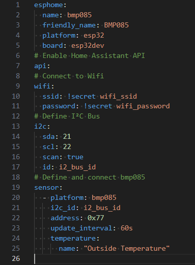

# ESPHome component design : Overview

ESPHome's primary  vocation is to enable users  with *no computer skills* to create electronic **modules**. To do this, ESPHome calls on a library of **components** which it assembles according to the user's requirements, automatically generating the code needed to realize the desired function. The user then simply assembles the various components required on an electronic board. Then connect it to a computer to load the code generated by ESPHome.

## Clarification of the terminology  used

- A '**device**' designates a set of **components** grouped together by a user to perform a specific function. In ESPHome, the description of a  module is defined in a yaml file. For example, you could define a module to measure room temperature. To do this, we'll use an ESP32 micro-controller connected via an I²C bus to a temperature sensor.
- A '**component**' is a basic element of the ESPHome library. Components can be physical, such as a sensor, or logical, such as an I²C bus. A component is defined by a set of files in C++ and Python.

A normal ESPHome **user** creates new **modules.** The modules are described in a Yaml configuration file, and from this description the ESPHome program automatically generates C++ code.  This code is compiled and an executable is generated. The resulting  firmware is loaded into the micro-controller's memory and run.
A **developer** for ESPHome will create new **components** for the library. This is a much more complex operation, as it requires the developer to describe how the component works , using both C++ and Python. This requires a good knowledge of C++, and basic noons of Python.
I was faced with the problem of creating an [ESPHome](https://esphome.io/) **module** that used **components** that *didn't exist* in the [ESPHome](https://esphome.io/) **library**. So I wondered what procedure and tools I should use to create this new component.

To my knowledge, there are many tutorials on creating  modules in ESPHome, but very few on creating  new components. So I went through a process of trial and error, with the help of other users, and eventually defined an environment and a process to follow. As I learned quite a lot along the way, I thought it would be interesting to share this experience. I'd like to make it clear  that this is how I do things, but of course there are other ways of doing things.

## **ESPHome's high-level vision**

I'll start by explaining how ESPHome works at a high level of abstraction,  as I understand it.
To create a new **module** in ESPHome, you need to define all the components you wish to use and how they are interconnected.  
For example, to create a 'room temperature measurement' module, you'll specify that you want to use: an ESP32 micro-controller installed on an esp32dev development board, connected to a BMP085 sensor via an I²C bus. The sensor measures the temperature and sends it back to Home Assistant via ESPHome's nave  Wifi API.  
The Yaml file will look like this:  

In this file, we indicate that we're creating a new  ESPHome module called 'test-bpm085', that the microprocessor used is an 'ESP32', which is mounted on an 'esp32dev' development board, that the module connects to your 'Wi-Fi' network, that it communicates with Home Assistant using the 'native api protocol', that it uses an 'I²C' bus, and that a 'BMP085 sensor' connected to the I²C bus returns the temperature.
Based on this description, ESPHome works its *magic*  by performing the following tasks:

- First, ESPHome reads the Yaml file. This enables it to list all the components used and to know all the interconnections ( internal creation of a netlist) . During this phase, the syntax and semantics of the Yaml file are checked. This is the preparation  and verification phase.
- Secondly, ESPHome will search its library for all the components used in this module. For example: a wifi component, an I2C component, an Api component, a BMP085 component, a sensor component, etc. It then copies the source code of these components into a directory created specifically for the module being assembled. To 'instantiate' and  'connect' the components to each other, he uses the netlist to generate a C++ file (main.cpp). This is the code generaon phase. During this phase, ESPHome also  generates all the necessary environment for PlatformIO . It then launches PlatformIO, which will create, download and run the resulting firmware on the hardware target.

This diagram describes the process:

So, to summarize, once the configuration file has been validated, the source files for the various components used are copied into the PlatformIO project, a main.cpp file  and the plaformio.ini file are generated, and control is passed to PlatformIO.
PlatformIO  checks that the necessary development environment, such as compilers, libraries, programming utilities, etc., are present and up-to-date. This environment is specified in the **platformio.ini** configuration file  generated by ESPHome. PlatformIO  will then compile and download the resulting code to the target device.
___
In this series of tutorials, we're going to focus not on the usage, but
on the creation of components that can then be used to create new modules.  
The process begins with :

- Writing documentation to show users how to  use our new component.  
- Writing Python files to validate  the module and generate C++ code from the user configuration.  
- Writing  C++ files to 'model' the component. This part of the development is the longest and most complex, since it requires detailed analysis of the component specifications , a minimum understanding of ESPHome's internal architecture, for writing the code that functionally models the component.
- Submiting your new component to the ESPHome library. This can be a  long and difficult phase, as the code and documentation for ESPHome components must comply with very strict rules. This phase requires dialogue with the person in charge of validating your component...
- Although it's not mentioned anywhere, I think that when you add  a new component to ESPHome it's implicitly understood that you're committed to maintaining that component (bug-fix and enhancement). For this, your GitHub developer name is associated with the component.

Next we are going to look at installing the correct software environment for developing our component.

- [Introduction document in English](/Part1-introduction/part1-introduction-en-US.pdf)
- [Video in French](https://youtu.be/cindv-3cWSg)
- [Document d'introduction en Français](/Part1-introduction/part1-introduction-fr-FR.pdf)
- [Yaml file for the example](/Part1-introduction/bmp085.yaml)
