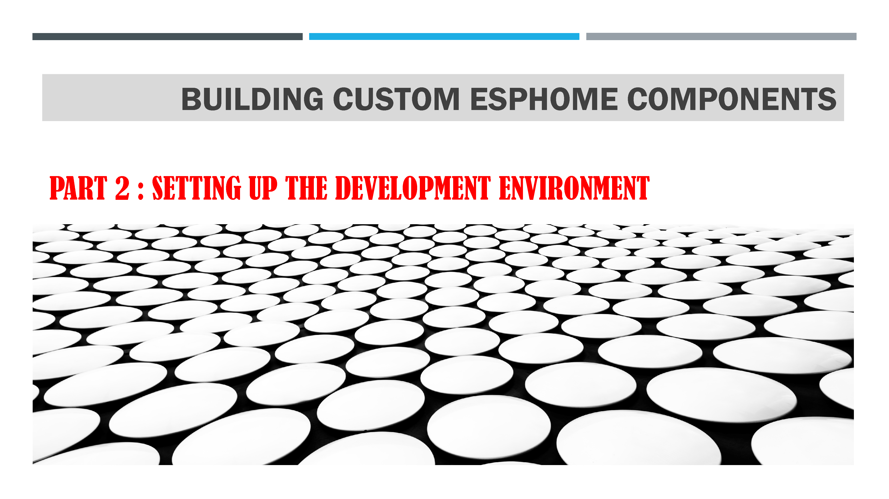
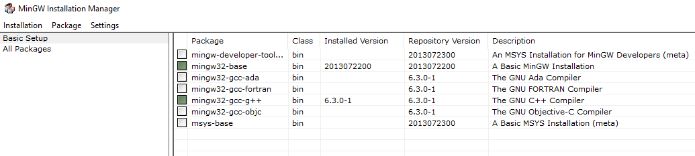
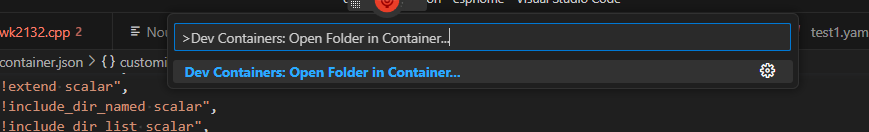
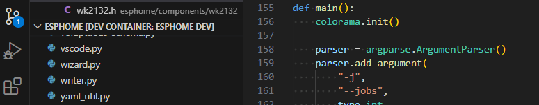
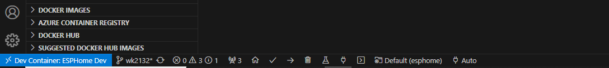
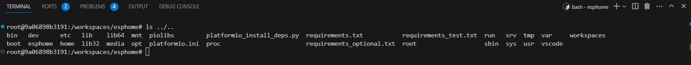
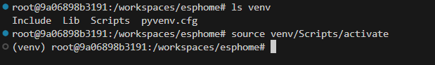
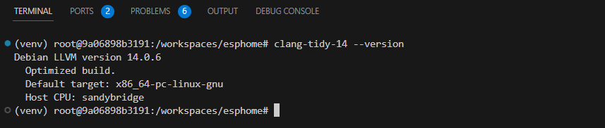
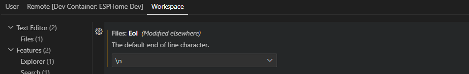
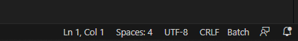

# Software development environment



***We are now going to install the different software needed to do development directly under Windows. Compared to using containers, this way of doing things is easy to understand and the performance is better. However, there are some operations that I couldn't get to work properly on Windows (like clang-tidy) that's why I have a section of this document that shows how to do development using the Dev Container of ESP Home. We'll see the usefulness of this when I describe the code submission process in GitHub.***

Each developer has their own habits and tools and therefore what I present here corresponds to my preferences. There are many alternative environments that can be used according to individual tastes.
The key pieces you will need are

- A code editor: I chose to use **Visual Studio Code** (VS Code).
- An integrated development environment (IDE): I chose **PlatformIO**.
- A version control system: I chose **Git**

This combination brings many functionalities like the completion and the intelligent checking of the C/C++ code during the writing, the integrated debugging, the management of the dependencies…
Note that if it is possible to choose what you want as a code editor, on the other hand the use of PlatformIO and Git is mandatory if you want to integrate your code into the ESPHome library. Also note that you need a GitHub account to integrate your component into ESPHome.
Since the software I have chosen is widely used, there are already a lot of tutorials that explain in detail how to install and use it. I will therefore content myself with giving a brief presentation.

## Software for code development

Here is the list of software I have installed on my development machine to create or modify ESPHome components. I describe here the installation on a PC with Windows, but this software is available on Linux and Mac.

**Important Installation Note**: I recommend selecting "install for you only" rather than "install for everyone" when given the choice. This will allow ESPHome to install its software in the "C:\Users\\<login_name\>\AppData\\.." directory which belongs to you and therefore open for writing and not in "C:\Program Files" which it is "read only".

### Git - Distributed version control system (must have)

A version control system is essential when doing code development. To be able to integrate your code in ESPHome it is imperative to install and use the software [Git](https://git-scm.com/download/win). Installation is standard and not described here.
After installation you must configure Git by filling in at least the variables "user.name" and "user.email" which will allow you to be identified. To do this, you can launch a "Git bash" and execute the following commands:

```bash
git config --global user.name "Your Name"
git config --global user.email<youremail@yourdomain.com>
git config --list
```

### Visual Studio Code (VS Code) - Code editor (must have)

As a code editor, I install  [Visual StudioCode](https://code.visualstudio.com/#alt-downloads). It is a very popular open-source code editor for its versatility and features, including Git integration, an integrated terminal, debugging tools, IntelliSense, and the existence of thousands of extensions. We will customize VS Code to create a development environment adapted to ESPHome which will make it possible to make checks and automatic formatting of your code in order to follow the rules imposed by ESPHome. Installation is standard and not described here.

### Installing Visual Studio Code Extensions

I recommend installing the following extensions:

- ***C/C++, C/C++ Extension Pack, C++ Themes***,
- ***CMake, CMake Tools, Makefile tools***,
- Python, Pylance, PyLint, Python indent, Black formatter
- Code Spell Checker, Code Runner, GitHub Pull Requests and Issues, GitLens, Remote SSH, Yaml

### PlatformIO IDE - Integrated Development Environment (must have)

[**PlatformIO**](https://platformio.org/), which is compatible with many microcontrollers, provides a unified development environment for multiple programming languages such as C++, Python. It offers debugging tools, library management, unit testing, and loads of other features to manage a project. This is the environment that is used by the ESPHome development teams. PlatformIO is installed as an extension of VS Code. The installation is done in VS Code it is standard and not described here.

### Installing ESPHome (must have)

It is essential to install ESPHome to be able to check, compile, and upload your component directly from your development machine.
To do this, you must clone the ESPHome repository on your development machine. This operation is anyway necessary if you want to create and submit a new component. We will see in more detail the complete process necessary but in summary you must fork ESPHome on your GitHub account and then clone it locally on your development machine.
In VS Code open the directory that contains ESPHome. PlatformIO will immediately initialize the project and install any extensions that are needed. It can take quite a while.
This is where it gets a little complicated because the documentation "[Setting Up Development Environment](file:///D:\Downloads\Setting%20Up%20Development%20Environment)" does not apply to Windows but only to Unix. So instead of the **script/setup** command, you actually have to type the command:

```bash
pip install -e .
```

This command will install the various utilities necessary for the proper functioning of ESPHome and if all goes well you should see a message like this:

```bash
Successfully installed esphome-2023.5.0.dev0
```

To verify that ESPHome is running correctly type the following command:

```bash
esphome version
```

Congratulations, you will now be able to compile the code for your component and send it to your development board directly from your system, including by launching a hardware debugging session.

### Python (recommended)

It is recommended (but not essential) to install [Python](https://www.python.org/downloads/)). During installation verify that Python is available from any location by changing your system's PATH variable. The installation is classic and not described here.

### C++ compile & debug (optional)

#### MinGW

This suite of applications allows you to compile and run programs written in C++. There is no need to install it if you don't want to do C++ development outside of ESPHome. Personally, I use MinGW which I install from  [mingw-get-setup](https://sourceforge.net/projects/mingw/) by choosing the packages "mingw32-base" and "mingw32-gcc-g++".

This installation is directly recognized by Visual studio code which allows you to launch or debug C++ programs directly in VS Code.

#### Visual Studio Community Edition (optional)

Another alternative if you are doing more substantial development in C++ is to install Microsoft's free software: Visual Studio Community Edition. It is a fantastic tool for doing development in many languages like C++, Python, C#, etc. Installing Visual Studio automatically installs Microsoft's C++ development environment. The installation is standard and is not described here.
If you want to use the C++ development environment directly in VS Code, you must first open a "Developer Command Prompt for VS" and launch VS Code from there by typing

```bash
VSCode .
```

### CMake Builder (optional)

This software completes the installation of MinGW C++ and Visual Studio. [CMake](https://cmake.org/) is used to control the software compilation process using simple, platform- and compiler-independent configuration files, and to generate native makefiles and workspaces that can be used in the environment of the compiler of your choice.

### Desktop GUI for Git (optional)

It is nice to have a graphical application to visualize the tree structure of its repositories and to be able to execute Git/GitHub commands from the menu. There are many programs to do this, for example [GitHub desktop](https://desktop.github.com/) or Git Gui, but personally I've been using for many years [Git Extensions](http://gitextensions.github.io/).

### Makefile (optional)

TODO

## Software for documentation

Installing documentation software is optional but useful for:

- Generate documentation on the code you write,
- You help in writing and debugging the documentation that is required to add a component to ESPHome.

### Generating documentation for C++ code (recommended)

I usually always document a minimum of my source code and for that I use the documentation generator [Doxygen](https://www.doxygen.nl/index.html). Doxygen is an open source code documentation generation software for many programming languages ​​such as C++, C, Python, etc. It generates documentation directly from the source code, making it easy to understand APIs, features, and implementation details. Visual studio code uses the same markup as Doxygen which allows real-time visualization of documentation, thanks to IntelliSense technology of classes, methods, parameters, etc. Doxygen also generates graphs such as inheritance and class association diagrams which help in understanding the code. I also install [Graphviz](https://graphviz.org/) for generating graphics and [Microsoft HTML Help Workshop](https://www.helpandmanual.com/downloads_mscomp.html) for generating documents in compressed HTML (more practical than hundreds of HTML files).
Note that the ESPHome developers use Doxygen to generate the ESPHome API documentation (available at [ESP Home API](https://esphome.io/api/index.html)) but unfortunately the source code of ESPHome is very (but really very) **poorly** documented!

### Generating component documentation (recommended)

The documentation of the components of the ESPHome library is available directly from the site [ESPHome](https://esphome.io/). There is one page (in html) per component. When you create a new component, you have to write documentation. This documentation should be written in the format [reStructuredText](https://docutils.sourceforge.io/rst.html) who uses [Sphinx](https://www.sphinx-doc.org/en/master/) to directly generate the HTML file from your text. To help you write, check, and visualize the exact rendering of your documentation there are several solutions in VS Code.
Personally I installed in VS Code the language server [esbonio](https://marketplace.visualstudio.com/items?itemName=swyddfa.esbonio).It tells you in real time if you make mistakes when writing Sphinx documentation, suggests the keywords to use and many other features like allowing you to visualize in real time the final HTML rendering in VS Code .
Note that there is another popular extension in VS Code called [reStructuredText](https://marketplace.visualstudio.com/items?itemName=lextudio.restructuredtext) but I couldn't get it to work properly so I use Esbonio which works fine.
Before you can use this extension, you must have installed Python. Then in VS Code you install the two extensions:[esbonio](https://marketplace.visualstudio.com/items?itemName=swyddfa.esbonio) (which installs Sphinx automatically) and [reStructuredText Syntax highlighting](https://marketplace.visualstudio.com/items?itemName=trond-snekvik.simple-rst)".

### Visual Studio Code extensions for documentation

In addition to Esbonio/Sphinx, there are hundreds of VS Code extensions that can be useful for generating documentation:

- DotUML, Doxygen Document Generator, …

### Creation of UML diagrams (optional)

It is interesting to document the classes of C++ code with UML diagrams. For this I recommend installing the software [Visual Paradigm Community Edition](https://www.visual-paradigm.com/download/community.jsp).

## Dev Container software development environment

***This section explains development in VS Code using ESPHome's Dev Container. The advantage of developing in the Dev Container is that you have almost no software to install and that you are in the same environment as the ESPHome developers. To use this environment, it is not essential to have knowledge of the use of Docker but it is still recommended to have basic notions. The section reference of this document points to articles that I recommend reading.***

During the development phase, I do not recommend the use of containers. But during the final code validation phase there are a number of pieces of software (especially *clang-tidy*) that I couldn't get to work properly in the Windows environment. And so, in this phase I advocate the use of ESPHome's Dev Container in VS Code. This allows all validation tests to be run locally. We will see this in more detail in the chapter on the "code submission procedure".
To use the ESPHome Dev Container in VS Code, you must first install a number of VS Code programs and extensions.

### WSL2 (must have)

Normally [installation is extremely simple](https://learn.microsoft.com/fr-fr/windows/wsl/install) when everything is going well.
Just open a PowerShell terminal as administrator and type the command:

```bash
wsl --install
```

On the other hand, if it does not go well, and it often does, then it can become complicated. To solve the problems, I recommend that you [read this Microsoft article](https://learn.microsoft.com/en-us/windows/wsl/troubleshooting).

### Docker Desktop (must have)

once you have installed WSL2 [installing Docker Desktop](https://docs.docker.com/desktop/install/windows-install/) should be done very simply. It is enough [run the installer](https://desktop.docker.com/win/main/amd64/Docker%20Desktop%20Installer.exe) and follow the instructions.

### VS Code plugins

In VS Code you need to install the extensions: **Dev Container**.
The VS Code Dev Containers extension allows you to use a container as a complete development environment taking advantage of the Visual Studio Code feature set. Workspace files are mounted from the local file system into the container. Extensions are installed and run in the container, where they have full access to the tools, platform, and file system. This means that you can change your development environment to that of ESPHome.

### Using the ESPHome Dev Container

The ESPHome directory contains all the information needed to be able to use ESPHome in a Dev Container. This gives access to a predefined Debian Linux environment where almost everything you need has already been preinstalled by the ESPHome teams. At the first opening of the Dev Container VS Code will check that all the necessary environment is present and up to date otherwise it will do the necessary.
To use the Dev Container: first launch Docker Desktop and launch VS Code, run the command, "**Dev Containers: Open folder in container...**" from the command palette (F1), and select the ESPHome folder.



The VS Code window reloads and begins building the development container. You only need to build the development container the first time you open it; opening the folder after the first successful build will be much faster. When the build is complete, VS Code automatically connects to the development container.

You should see that VSCode uses the ESPHome container.



If you open a "terminal" window, you are now in a Linux environment with the ESPHome directory mounted in /workspaces/esphome.



To complete the installation of ESPHome type the following command:

```bash
script/setup
```

Running the setup script can take a long time, so be patient.
At the end to check that ESPHome is correctly installed type

```bash
esphome version
```

Note that the documentation tells you to run the command

```bash
source venv/Script/activate
```

But in reality, as we are in a container there is no need to launch a venv environment.

*Note that after the first command the prompt indicates that you are now in the venv environment.*
That's ESPHome installed and configured on Linux. We will see in the GitHub procedure chapter how to use it.
at the .devcontainer/devcontainer.json file included in your project tells VS Code how to access the development container with a well-defined stack of tools and runtimes.

### Installing LLMV Suite in ESPHome DevContainer

A number of clang-related utilities (at least clang-tidy-14 and clang-apply-replacements-14) are missing from the container provided by ESPHome. To overcome this problem, the easiest way is to install the following **[LLVM](https://llvm.org/)** using the script he provides.

The Linux running in the Dev Container is Debian GNU/Linux 11. To verify this, you can type the following commands:

```bash
cat /etc/issue
cat /etc/os-release
```

And to get the LLVM installation shell type the commands:

```bash
apt-update
apt-upgrade
apt install wget
wget -O - https://apt.llvm.org/llvm.sh \> llvm.sh
chmod +x llvm.sh
apt install lsb-release wget software-properties-common gnupg
```

If we want version 14 which is the one used in ESPHome and which avoids modifying the scripts, we type the command:

```bash
./llvm.sh 14 all
```

Note that the script detects that you are on a Debian version and apply the necessary workarounds to this version (see <https://bugs.debian.org/cgi-bin/bugreport.cgi?bug=1038383>).
To verify the installation, type:

```bash
Clang-tidy-14 --version
```



## Customization (settings) of software

### Git

We have already seen that it is necessary to specify the variables user name and user email.
It is also important to check how Git will handle line endings. I recommend, especially if you use containers, to set this option to Unix mode:

```bash
git config --global core.autocrlf input
```

***Be careful if you change the mode this only applies to new files that you add but not to existing files***.
In VS Code: go to setting and search for Eol. Set it to \n

When a file is opened, it indicates at the bottom right the Eol mode of this file:


Here we are in CRLF mode (Windows mode). If you want to switch it to LF mode (Unix mode) click on this text and change the mode directly.
Note that normally you shouldn't have to worry about this issue because ESPHome has a .gitattributes file that contains:

```bash
\# Normalize line endings to LF in the repository
\* text eol=lf
\*.png binary
```

If you want to work in both environments, you can modify this file with:

```bash
\# Normalize line endings to LF in the repository
\* text=auto eol=lf
\*.{cmd,\[cC\]\[mM\]\[dD\]} text eol=crlf
\*.{bat,\[bB\]\[aA\]\[tT\]} text eol=crlf
\*.png binary
```

### VSCode

It is recommended to make a number of adjustments in VS Code.
There are settings common to all projects such as automatic saving of files (personally I set it to save when you change windows). These settings are stored in the file:

```bash
C:\Users\\YourLoginName\>\AppData\Roaming\Code\User\settings.json
```

Where \<YourLoginName\> is your login name.
Here is for example my settings file

```yaml
{
  "C_Cpp.default.compilerPath": "C:\\MinGW\\bin\\gcc.exe",
  "cSpell.userWords": \[
    "codegen",
    "CODEOWNERS",
    "GPIO",
    "uart",
    "apiref",
    "Datasheet",
    "ghedit",
    "GPIO",
    "Mbit",
    "pmsx",
    "pullup",
    "UART"
  \],

  "cSpell.ignoreWords": \[
    "toctree"
  \],
  "cSpell.diagnosticLevel": "Hint",
  "cSpell.language": "en,en-US"
  // "code-runner.runInTerminal": true,
  "editor.renderWhitespace": "all",
  "editor.formatOnSave": true,
  "editor.guides.bracketPairs": "active",
  "files.autoSave": "onFocusChange",
  "\[python\]": {
    "editor.formatOnType": true,
    "editor.defaultFormatter": "ms-python.black-formatter"
  },
}
```

And there are settings that are specific to the project.
For the ESPHome project, there is nothing special to note
For the ESPHome-docs project, I specify some values ​​for the esbonio extension to build the HTML files in a \_buid directory (specified in .gitignore). This file is located in the project:

```bash
.\\vscode\settings.json
```

Here is its content:

```yaml
{
  "esbonio.sphinx.confDir": "",
  "esbonio.sphinx.buildDir": "C:\\Work\\Projects\\esphome-docs\\\_build",
  "esbonio.sphinx.configOverrides": {},
}
```

## Tips and tricks…

### Useful Shortcuts in VS Code

Opening/closing windows:

- Show Palette: F1 or Ctrl Shift p
- Show Settings: Ctrl ,
- Show panel: Ctrl j or Ctrl ù
- Show sidebar Ctrl b
- show find: Ctrl f – replace: Ctrl h
- Find symbols in file: Ctrl Shift o – in workspace: Ctrl T
- show suggestions: Ctrl Space or Ctrl I
- show recommended actions: Ctrl;

Cursor movement:

- Jump to definition: F12 – Peek definition: Alt F12
- Jump matching bracket: Ctrl Shift \*
- Jump to line: Ctrl G

- Move a row: Alt Up or Down

Selections:

- Select a line: Click line number
- Add line to selection (useful for line-staging): Alt Click line number
- Add to selection the next same word: Ctrl D – all the same words: Ctrl Shift L
- Selection of a box = Alt Shift Left or Right
- Multi Cursors: Alt Click
- Cursor column: Ctrl Alt Up or Down
- inclusion block (extended selection): Alt Shift Right or Left

## References

### DevContainer

- [GitHub Codespaces](https://docs.github.com/en/codespaces/overview)(GitHub)
- [Introduction to dev containers (GitHub)](https://docs.github.com/en/codespaces/setting-up-your-project-for-codespaces/adding-a-dev-container-configuration/introduction-to-dev-containers)
- [Developing inside a Container](https://code.visualstudio.com/docs/devcontainers/containers)(MS)
- [Remote Development Tips and Tricks](https://code.visualstudio.com/docs/remote/troubleshooting#_resolving-git-line-ending-issues-in-wsl-resulting-in-many-modified-files)(MS)

### Docker

- [Install Docker Desktop on Windows](https://docs.docker.com/desktop/install/windows-install/)(docker)
- [Docker in Visual Studio Code (MS)](https://code.visualstudio.com/docs/containers/overview)

### ESP Home

- [Contributing to ESP Home](https://esphome.io/guides/contributing.html#setting-up-git-environment)(ESPHome)
- [Generic Custom Component](https://esphome.io/custom/custom_component.html)(ESPHome)
- [Custom Sensor Component](https://d.docs.live.net/d4b909a53d0925af/Documents/Document%20Notariaux)(ESPHome)
- [Submit your work](https://developers.home-assistant.io/docs/development_submitting)(HA)
- [Catching up with Reality](https://developers.home-assistant.io/docs/development_catching_up)(HA)

### Espressif / Arduino – Programming/Reference

- [ESP-IDF Programming Guide](https://docs.espressif.com/projects/esp-idf/en/latest/esp32/)
- [ESP32 Technical Reference Manual](https://www.espressif.com/sites/default/files/documentation/esp32_technical_reference_manual_en.pdf)
- [Arduino Language Reference](https://arduinogetstarted.com/arduino-language-reference)
- [Arduino MultiSpeed I2C Scanner](https://github.com/RobTillaart/MultiSpeedI2CScanner)
- [I²C Scanner code](https://playground.arduino.cc/Main/I2cScan)
- [Working with I2C Devices](https://learn.adafruit.com/working-with-i2c-devices)
- [How many Devices can you Connect to the I2C Bus?](https://www.bluedot.space/tutorials/how-many-devices-can-you-connect-on-i2c-bus/#:~:text=As%20mentioned%20earlier%2C%20connecting%20multiple,and%20the%20ground%20(GND))
- [PlatformIO Tutorial for Arduino and ESP – First Steps with Visual Studio Code](https://www.youtube.com/watch?v=SAVczh7W1Oc)(Video EN)
- [Getting Started with VS Code and PlatformIO IDE for ESP32 and ESP8266](https://randomnerdtutorials.com/vs-code-platformio-ide-esp32-esp8266-arduino/)
- [Understanding the I2C bus (Video EN)](https://www.youtube.com/watch?v=15XY4LoQyjc)

### Git/GitHub

- [Contributing to projects](https://docs.github.com/en/get-started/quickstart/contributing-to-projects)(GitHub)
- [Git and GitHub for Beginners - Crash Course](https://www.youtube.com/watch?v=RGOj5yH7evk)(Video EN)
- [Working with GitHub in VS Code](https://code.visualstudio.com/docs/sourcecontrol/github)
- [Git](https://cours-web.ch/git/)
- [Using Git with VS Code and PlatformIO](https://www.youtube.com/watch?v=NdgMuZBpyo8&t=33s)(Video EN)

### VS Code

- [Snippets in Visual Studio Code](https://code.visualstudio.com/docs/editor/userdefinedsnippets)(MS)
- [C/C++ for Visual Studio Code](https://code.visualstudio.com/docs/languages/cpp)
- [Configure VS Code for Microsoft C++](https://code.visualstudio.com/docs/cpp/config-msvc)
- [How to run a C program in Visual Studio Code?](https://www.javatpoint.com/how-to-run-a-c-program-in-visual-studio-code)
- [VS Code documentation](https://code.visualstudio.com/docs)
- [Visual Studio Code Crash Course](https://www.youtube.com/watch?v=WPqXP_kLzpo)

### WSL

- [Install Linux on Windows with WSL](https://learn.microsoft.com/fr-fr/windows/wsl/install)(MS)
- [Troubleshooting Windows Subsystem for Linux](https://learn.microsoft.com/en-us/windows/wsl/troubleshooting)
- [Set up a WSL development environment](https://learn.microsoft.com/en-us/windows/wsl/setup/environment?source=recommendations)
